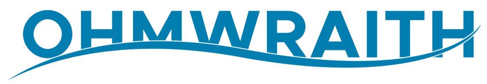

# Hi, I'm Vasilii 👋

<h3 align="center">Security • Networking • Self-hosted Infrastructure</h3>

---

Currently exploring automation and building my own self-hosted environment.

---

## 🧠 Current focus

- Developing and maintaining a personal infrastructure
- Automation and scripting
- Networking and traffic management
- Containerized services (Docker / Compose)

---

## 🚧 Exploring

- CI/CD for self-hosted services  
- Kubernetes  
- Expanding personal infrastructure  

---

## ⚙️ Stack

---

## 🧩 Projects

---

## 🎯 Experience

- CTF and cyber battles

---

## 🎮 Interests

- Game servers and modifications (Minecraft/ Source / Half-Life)

## 📝 Notes

Most of my current work is focused on infrastructure and self-hosted systems,  
so I don’t publish much code publicly.

---

## 📊 Stats

